# Skill Evaluator Knowledge Graph

> 개념 지도 / 지식 그래프 - 계속 노드를 추가하며 확장
>
> **노드 추가 방법**: `새노드ID[라벨] -->|관계| 기존노드`
> **참고 자료 추가**: `REF_XX["📚 출처"]:::reference -.->|참고| 노드`
> **진행 상태 표시**: `:::done`(완료), `:::wip`(진행중), `:::todo`(예정)
>
> 마지막 수정: 2026-02-10

```mermaid
graph TD
    %% ========================================
    %% 핵심 계층 구조 (L1-L6)
    %% ========================================
    A[구조적 무결성<br/>Structural Integrity<br/>기초 단계] -->|구조가 갖춰져야| B[활성화<br/>Trigger & Activation<br/>의존: 1번 성공 시]
    B -->|스킬이 로드되어야| C[검색<br/>Retrieval & Resources<br/>의존: 2번 활성화 시]
    B -->|트리거 후 시작| D[워크플로우<br/>Workflow<br/>의존: 3번 정보 공급]

    %% 정보 및 맥락 의존성
    C -->|검색된 정보가<br/>맥락 제공| D
    D -->|계획이 명확해야| E[실행<br/>Execution & Action<br/>의존: 4번 가이드]

    %% 실행 및 검증 체인
    E -->|실행 결과로| F[검증<br/>Validation<br/>의존: 5번 실행 결과]

    %% ========================================
    %% L1: 구조적 무결성 세부
    %% ========================================
    A1[1.1 표준 규격 준수] -.->|구현| A
    A11[YAML 프론트매터 검증<br/>name + description] -.-> A1
    A12[형식 유효성<br/>Instructions + Examples] -.-> A1

    A2[1.2 리소스 독립성] -.->|구현| A
    A21[Self-contained 폴더 구조] -.-> A2
    A22[디렉토리 아키텍처<br/>./scripts, ./resources] -.-> A2

    REF_A1["📚 Anthropic Skills<br/>YAML 프론트매터 표준"]:::reference -.->|참고| A1
    REF_A2["📚 Claude Skills Collection<br/>디렉토리 아키텍처"]:::reference -.->|참고| A2
    REF_A3["📚 A-RAG<br/>리소스 구조 설계"]:::reference -.->|참고| A2

    %% ========================================
    %% L2: 활성화 세부
    %% ========================================
    B1[2.1 트리거 전략 최적화] -.->|구현| B
    B11[Explicit Trigger Section] -.-> B1
    B12[단일 책임 원칙<br/>Single Responsibility] -.-> B1

    B2[2.2 활성화 성능 측정] -.->|측정| B
    B21[활성화 성공률] -.-> B2
    B22[의도 인식 기술<br/>Intent Recognition] -.-> B2

    REF_B1["📚 ReliabilityBench<br/>트리거 조건 평가"]:::reference -.->|참고| B1
    REF_B2["📚 LLM Agent Survey<br/>Pass@k, 성공률 지표"]:::reference -.->|참고| B2
    REF_B3["📚 AgentBench/WebShop<br/>인텐트 인식 벤치마크"]:::reference -.->|참고| B2

    %% ========================================
    %% L3: 검색 세부
    %% ========================================
    C1[3.1 검색 품질 지표] -.->|측정| C
    C11[Hit Rate@k + MRR] -.-> C1
    C12[Context Precision/Recall] -.-> C1

    C2[3.2 에이전틱 RAG] -.->|구현| C
    C21[계층적 검색 인터페이스] -.-> C2
    C22[Context Efficiency<br/>노이즈 제거] -.-> C2

    REF_C1["📚 A-RAG<br/>HitRate@k, 토큰 효율"]:::reference -.->|참고| C1
    REF_C2["📚 A-RAG HTML<br/>계층적 인터페이스"]:::reference -.->|참고| C2
    REF_C3["📚 AgenticRAG<br/>RAG 전략 구현"]:::reference -.->|참고| C2

    %% ========================================
    %% L4: 워크플로우 세부
    %% ========================================
    D1[4.1 계획 수립 및 준수] -.->|구현| D
    D11[Plan Adherence] -.-> D1
    D12[다단계 추론 일관성] -.-> D1

    D2[4.2 컨텍스트 최적화] -.->|구현| D
    D21[단계별 컨텍스트 정밀도] -.-> D2
    D22[워크플로우 가이드라인] -.-> D2

    REF_D1["📚 Zero-Shot Planners<br/>Plan Adherence 측정"]:::reference -.->|참고| D1
    REF_D2["📚 ChatDev<br/>다단계 워크플로우"]:::reference -.->|참고| D1
    REF_D3["📚 A-RAG<br/>Test-time Scaling"]:::reference -.->|참고| D2
    REF_D4["📚 LLMs as Workers<br/>단계별 컨텍스트"]:::reference -.->|참고| D2

    %% ========================================
    %% L5: 실행 세부
    %% ========================================
    E1[5.1 실행 성능] -.->|측정| E
    E11[TSR - Tool Success Rate] -.-> E1
    E12[매개변수 매핑 정확도] -.-> E1

    E2[5.2 실행 신뢰성] -.->|측정| E
    E21[Pass^k - 일관성] -.-> E2
    E22[ECR - Execution Correctness] -.-> E2

    REF_E1["📚 ReliabilityBench<br/>TSR, ECR 분리 평가"]:::reference -.->|참고| E1
    REF_E2["📚 ReliabilityBench HTML<br/>Fault Injection"]:::reference -.->|참고| E1
    REF_E3["📚 LLM Agent Survey<br/>Pass^k 변종"]:::reference -.->|참고| E2
    REF_E4["📚 AgentBench/AgentBoard<br/>도구 호출 성공률"]:::reference -.->|참고| E1

    %% ========================================
    %% L6: 검증 세부
    %% ========================================
    F1[6.1 가설 검증] -.->|구현| F
    F11[스크립트 기반 검증률] -.-> F1
    F12[충실성 Faithfulness] -.-> F1

    F2[6.2 실패 모드 분석] -.->|구현| F
    F21[Action Phase Failure] -.-> F2
    F22[GPA 실패 로컬라이징] -.-> F2
    F23[LLM-as-Judge 신뢰도<br/>Gwet's AC2] -.-> F2

    REF_F1["📚 ReliabilityBench<br/>AMR, End-state Equivalence"]:::reference -.->|참고| F1
    REF_F2["📚 A-RAG<br/>Faithfulness 분석"]:::reference -.->|참고| F1
    REF_F3["📚 ReliabilityBench HTML<br/>Layer별 실패 분석"]:::reference -.->|참고| F2
    REF_F4["📚 MCP Safety Audit<br/>GPA 실패 로컬라이징"]:::reference -.->|참고| F2
    REF_F5["📚 LLM Agent Survey<br/>Gwet's AC2"]:::reference -.->|참고| F2

    %% ========================================
    %% GPA 프레임워크 매핑 (역추적)
    %% ========================================
    G[Goal 실패<br/>활성화+검색 문제] -.->|역추적| B
    G -.->|역추적| C
    H[Plan 실패<br/>워크플로우 문제] -.->|역추적| D
    I[Action 실패<br/>실행+검증 문제] -.->|역추적| E
    I -.->|역추적| F

    REF_GPA1["📚 Zero-Shot Planners<br/>Goal-Action 체인"]:::reference -.->|참고| G
    REF_GPA2["📚 ChatDev<br/>단계별 실패율"]:::reference -.->|참고| H
    REF_GPA3["📚 ReliabilityBench<br/>Layer별 분석"]:::reference -.->|참고| I

    %% ========================================
    %% 확장 영역 (여기에 노드 추가)
    %% ========================================

    %% ========================================
    %% 스타일 정의
    %% ========================================
    classDef structural fill:#e1f5ff,stroke:#0066cc,stroke-width:2px
    classDef trigger fill:#fff4e1,stroke:#ff9800,stroke-width:2px
    classDef retrieval fill:#f3e5f5,stroke:#9c27b0,stroke-width:2px
    classDef workflow fill:#e8f5e9,stroke:#4caf50,stroke-width:2px
    classDef execution fill:#fff3e0,stroke:#ff6f00,stroke-width:2px
    classDef validation fill:#ffebee,stroke:#d32f2f,stroke-width:2px
    classDef category fill:#e0e0e0,stroke:#616161,stroke-width:1.5px
    classDef detail fill:#fafafa,stroke:#9e9e9e,stroke-width:1px
    classDef gpa fill:#fce4ec,stroke:#c2185b,stroke-width:1px,stroke-dasharray: 5 5
    classDef reference fill:#e8f5e9,stroke:#2e7d32,stroke-width:1.5px,stroke-dasharray: 3 3
    classDef done fill:#c8e6c9,stroke:#2e7d32,stroke-width:2px
    classDef wip fill:#fff9c4,stroke:#f9a825,stroke-width:2px
    classDef todo fill:#ffcdd2,stroke:#c62828,stroke-width:1px

    class A structural
    class B trigger
    class C retrieval
    class D workflow
    class E execution
    class F validation
    class A1,A2,B1,B2,C1,C2,D1,D2,E1,E2,F1,F2 category
    class A11,A12,A21,A22,B11,B12,B21,B22,C11,C12,C21,C22,D11,D12,D21,D22,E11,E12,E21,E22,F11,F12,F21,F22,F23 detail
    class G,H,I gpa
    class REF_A1,REF_A2,REF_A3,REF_B1,REF_B2,REF_B3,REF_C1,REF_C2,REF_C3,REF_D1,REF_D2,REF_D3,REF_D4,REF_E1,REF_E2,REF_E3,REF_E4,REF_F1,REF_F2,REF_F3,REF_F4,REF_F5,REF_GPA1,REF_GPA2,REF_GPA3 reference
```

